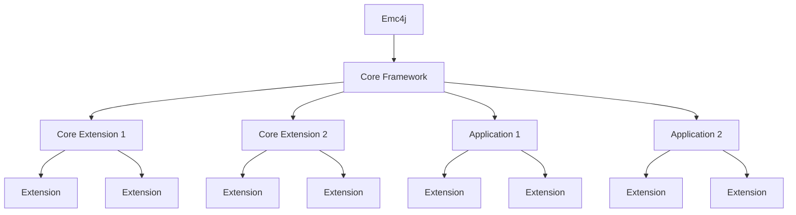

# Emc4j #

Emc4j is a framework allowing to load extensible applications from maven repositories.
It has been designed mainly for desktop applications, but can be used for any kind of Java application.

<b>Keep in mind that Emc4j is still in early development and not production ready.</b>

In Emc4j everything is an extensions, including the core framework itself. You can compose your application by combining core extensions and application extensions.
To do so, emc4j relies on special artifacts named "registries" that contains the list of extensions to load and where to attach them.

Each extension is loaded in a dedicated module layer and don't have any arbitrary access to siblings or children, only the parent is accessible.

Internaly Emc4j uses SpringBoot to provides out of the box a dedicated context for each extension.

By default, Emc4j won't scan any class in an extension and rely on a declarative syntax to know which class must be loaded in a context.
This allows to have a faster startup time and avoid any classpath scanning. It is still possible (but not advised) to use scanning if it is needed)

Extensions are loaded in a dedicated context, allowing to have isolated beans and configurations from siblings. Each extension context can still access the parent context to reuse common beans.

Out of the box Emc4j provides to extensions:
- A maven client to download artifacts from remote repositories
- Support for dependency injection and distribution of beans across contexts
- Support for transactional JPA repositories backed by a shared H2 database
- Support for RestControllers to expose REST endpoints
- Support for AspectJ to add cross cutting concerns
- Support for configuration properties loaded from files or environment variables

Emc4j is open source, and it is freely licensed under the BSD license.

## Getting started ##

The best way to get started with Emc4j is the documentation

See the [documentation](https://emc4j.treilhes.com).

For community support, go to [StackOverflow](https://stackoverflow.com/questions/tagged/emc4j).

## Issues and Contributions ##

Issues can be reported to the [Issue tracker](https://github.com/treilhes/emc4j/issues/)

Contributions can be submitted via [Pull requests](https://github.com/treilhes/emc4j/pulls/) 

## Building Emc4j ##

### Requisites ###

To fork and build your local version.

These are the requisites:

* A recent version of [JDK 25 or later](https://www.oracle.com/technetwork/java/javase/downloads/index.html)
* A recent standalone version of [Maven 3.8.6 or later](https://maven.apache.org/)

### How to build Emc4j ###

To build the Emc4j, on the project's root, run:

`mvn clean package`

### How to run Emc4j ###

Emc4j can't be run as is, you need to create a root extension for it to load and install this root extension into your local repository.
To do so, you will first have to install Emc4j dependencies in your local repository.

This is achieved by:

`mvn clean install`

Then you will need to 
- [create your root extension](https://github.com/treilhes/emc4j/???TBD???)
- [create a registry](https://github.com/treilhes/emc4j/???TBD???)
- [run your application localy](https://github.com/treilhes/emc4j/???TBD???)

Alternatively, you can take a look at [JfxPlace](https://github.com/treilhes/jfxplace) an already existing root extension implementation for JavaFx applications.

